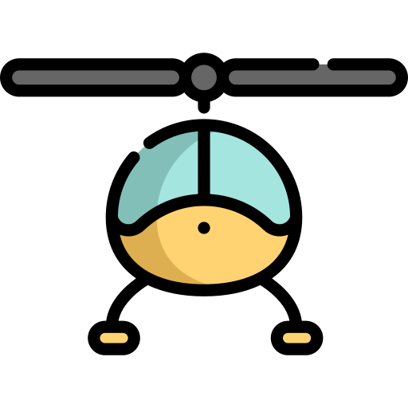

<p align="center">
 
</p>

<br />

[]()
[]()
[]()
[](https://github.com/prettier/prettier)
[](#contributors-)
[](https://github.com/ngneat/)
[]()
[]()

> A Powerful Tooltip and Popover for Angular Applications

[Tippy.js](https://atomiks.github.io/tippyjs/v6/getting-started/) is the complete tooltip, popover, dropdown, and menu
solution for the web, powered by Popper.js.

It is an abstraction over Popper that provides the logic and optionally the styling involved in all types of elements
that pop out from the flow of the document and get overlaid on top of the UI, positioned next to a reference element.

This is a lightweight wrapper with additional features that lets you use it declaratively in Angular. Tippy has
virtually no restrictions over Popper and gives you limitless control while providing useful behavior and defaults.

If you're using v1 and don't want to migrate, you can find it [here](https://github.com/ngneat/helipopper/tree/v1).

## Features

✅ Position Tooltips, Menus, Dropdowns, and Popovers <br>
✅ Predefined Variations <br>
✅ TemplateRef/Component Support<br>
✅ Lazy Registration<br>
✅ Manual Trigger Support<br>
✅ Text Overflow Support<br>
✅ Context Menu Support<br>

### Installation

```
ng add @ngneat/helipopper
```

It will automatically add the `TippyModule` to your `AppModule`. You can configure it as shown below:

```ts
import { TippyModule, tooltipVariation, popperVariation } from '@ngneat/helipopper';

@NgModule({
  declarations: [AppComponent],
  imports: [TippyModule.forRoot({
    defaultVariation: 'tooltip',
    variations: {
      tooltip: tooltipVariation,
      popper: popperVariation,
    }
  })],
  bootstrap: [AppComponent]
})
export class AppModule {
}
```

Add the styles you want to `styles.scss`:

```scss
@import '~tippy.js/dist/tippy.css';
@import '~tippy.js/themes/light.css';
@import '~tippy.js/animations/scale.css';
```

You have the freedom to [customize](https://atomiks.github.io/tippyjs/v6/themes/) it if you need to.

Now you can use it in your templates:

```html

<button tippy="Helpful Message">
  I have a tooltip
</button>
```

The library exposes default variations for `tooltip` and `popper`. You can use them, extend them, or pass your own
variations. A `variation` is a set of predefined `tippy` properties. For example, here's how the built-in `tooltip`
variation looks like:

```ts
export const tooltipVariation = {
  theme: null,
  arrow: false,
  animation: 'scale',
  trigger: 'mouseenter',
  offset: [0, 5]
};
```

### Use `TemplateRef` as content

```html
<button [tippy]="tpl" variation="popper">
  Click Me
</button>

<ng-template #tpl let-hide>
  <h6>Popover title</h6>
  <p>And here's some amazing content. It's very engaging. Right?</p>
</ng-template>
```

### Use `Component` as content

```ts
import { TIPPY_REF, TippyInstance } from '@ngneat/helipopper';

@Component()
class MyComponent {
  constructor(@Inject(TIPPY_REF) tippy: TippyInstance) {
  }
}
```

```html
<button [tippy]="MyComponent">
  Click Me
</button>
```

### Text Overflow

You can pass the `onlyTextOverflow` input to show the tooltip only when the host overflows its container:

```html
<div style="max-width: 100px;" class="overflow-hidden flex">
  <p class="ellipsis" [tippy]="text" placement="right" [onlyTextOverflow]="true">
    {{ text }}
  </p>
</div>
```

Note that it's using [`ResizeObserver`](https://caniuse.com/resizeobserver) api.


### Lazy

You can pass the `lazy` input when you want to defer the creation of tippy only when the element is in the view:

```html
<div *ngFor="let item of items" 
     [tippy]="item.label" 
     [lazy]="true">{{ item.label }}
</div>
```

Note that it's using [`IntersectionObserver`](https://caniuse.com/intersectionobserver) api.

### Context Menu
First, define the `contextMenu` variation:
```ts
import { 
  popperVariation, 
  TippyModule, 
  tooltipVariation, 
  withContextMenuVariation 
} from '@ngneat/helipopper';

@NgModule({
  imports: [
    TippyModule.forRoot({
      defaultVariation: 'tooltip',
      variations: {
        tooltip: tooltipVariation,
        popper: popperVariation,
        contextMenu: withContextMenuVariation(popperVariation),
      }
    })
  ],
})
export class AppModule {}
```

Now you can use it in your template:

```html
<ng-template #contextMenu let-hide let-item="data">
  <ul>
    <li (click)="copy(item); hide()">Copy</li>
    <li (click)="duplicate(item); hide()">Duplicate</li>
  </ul>
</ng-template>

<ul>
  <li *ngFor="let item of list" 
      [tippy]="contextMenu" 
      [data]="item" 
      variation="contextMenu">
    {{ item.label }}
  </li>
</ul>
```

### Manual Trigger

```html
<div tippy="Helpful Message" trigger="manual" #tooltip="tippy">
  Click Open to see me
</div>

<button (click)="tooltip.show()">Open</button>
<button (click)="tooltip.hide()">Close</button>
```

### Show/hide declarativly

Use isVisible to trigger show and hide. Set trigger to manual.

```html
<div tippy="Helpful Message" trigger="manual" [isVisible]="visibility">
  Click Open to see me
</div>

<button (click)="visibility = true">Open</button>
<button (click)="visibility = false">Close</button>
```

You can see more examples in
our [playground](https://github.com/ngneat/helipopper/blob/master/src/app/app.component.html), or
live [here](https://ngneat.github.io/helipopper/).

### Inputs

```ts
appendTo: TippyProps['appendTo'];
delay: TippyProps['delay'];
duration: TippyProps['duration'];
hideOnClick: TippyProps['hideOnClick'];
interactive: TippyProps['interactive'];
interactiveBorder: TippyProps['interactiveBorder'];
maxWidth: TippyProps['maxWidth'];
offset: TippyProps['offset'];
placement: TippyProps['placement'];
popperOptions: TippyProps['popperOptions'];
showOnCreate: TippyProps['showOnCreate'];
trigger: TippyProps['trigger'];
triggerTarget: TippyProps['triggerTarget'];
zIndex: TippyProps['zIndex'];
tippyHost: HTMLElement;

lazy: boolean;
variation: string;
isEnabled: boolean;
isVisible: boolean;
className: string;
onlyTextOverflow: boolean;
useHostWidth: boolean;
hideOnEscape: boolean;
data: any;
```

### Outputs

```ts
visible = new EventEmitter<boolean>();
```

### Global Config
- You can pass any `tippy` option at global config level. 
- `beforeRender` - Hook that'll be called before rendering the tooltip content ( applies only for string )

### Create `tippy` Programmatically

```typescript
import { TippyService, TippyInstance } from '@ngneat/helipopper';

class Component {
  @ViewChild('inputName') inputName: ElementRef;
  private tippy: TippyInstance;

  constructor(private tippy: TippyService) {
  }

  open() {
    if(!this.tippy) {
      this.tippy = this.tippy.create(this.inputName, 'this field is required');
    }

    this.tippy.open();
  }

  ngOnDestroy() {
    this.tippy?.destroy();
  }
}
```

## Contributors ✨

Thanks goes to these wonderful people ([emoji key](https://allcontributors.org/docs/en/emoji-key)):

<!-- ALL-CONTRIBUTORS-LIST:START - Do not remove or modify this section -->
<!-- prettier-ignore-start -->
<!-- markdownlint-disable -->
<table>
  <tr>
    <td align="center"><a href="https://www.netbasal.com/"><br /><sub><b>Netanel Basal</b></sub></a><br /><a href="https://github.com/@ngneat/helipopper/commits?author=NetanelBasal" title="Code">💻</a> <a href="https://github.com/@ngneat/helipopper/commits?author=NetanelBasal" title="Documentation">📖</a> <a href="#ideas-NetanelBasal" title="Ideas, Planning, & Feedback">🤔</a></td>
    <td align="center"><a href="https://github.com/itayod"><br /><sub><b>Itay Oded</b></sub></a><br /><a href="https://github.com/@ngneat/helipopper/commits?author=itayod" title="Code">💻</a></td>
    <td align="center"><a href="https://gerome-dev.netlify.com/"><br /><sub><b>Gérôme Grignon</b></sub></a><br /><a href="https://github.com/@ngneat/helipopper/commits?author=geromegrignon" title="Code">💻</a></td>
    <td align="center"><a href="https://medium.com/@overthesanity"><br /><sub><b>Artur Androsovych</b></sub></a><br /><a href="https://github.com/@ngneat/helipopper/commits?author=arturovt" title="Code">💻</a> <a href="https://github.com/@ngneat/helipopper/commits?author=arturovt" title="Tests">⚠️</a></td>
    <td align="center"><a href="https://github.com/shaharkazaz"><br /><sub><b>Shahar Kazaz</b></sub></a><br /><a href="https://github.com/@ngneat/helipopper/commits?author=shaharkazaz" title="Code">💻</a> <a href="https://github.com/@ngneat/helipopper/commits?author=shaharkazaz" title="Documentation">📖</a></td>
    <td align="center"><a href="https://houseofangular.io/team/"><br /><sub><b>stefanoww</b></sub></a><br /><a href="https://github.com/@ngneat/helipopper/commits?author=stefanoww" title="Code">💻</a></td>
  </tr>
</table>

<!-- markdownlint-restore -->
<!-- prettier-ignore-end -->

<!-- ALL-CONTRIBUTORS-LIST:END -->

This project follows the [all-contributors](https://github.com/all-contributors/all-contributors) specification.
Contributions of any kind welcome!
Icon made by <a href="https://www.flaticon.com/authors/freepik" title="freepik">Airport</a>
from <a href="https://www.flaticon.com/" title="Flaticon"> www.flaticon.com</a>
